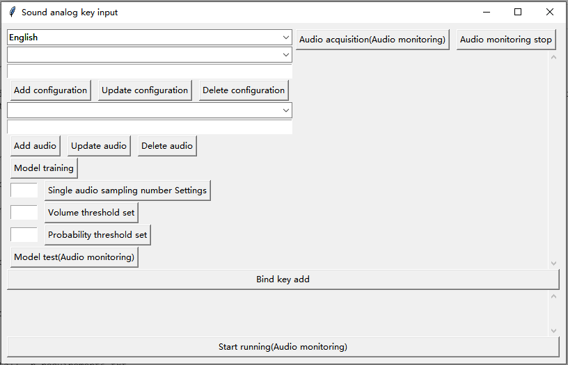

# Sound analog key input

## 1. Introduction

Each voice input multiple audio, as a data set for model training, binding device input keys, so that the generation model to monitor each voice forecast, the result of the binding key for analog input.

## 2. Software screenshot

## 3. Install

### (1)conda creates the environment

conda create -n sound_analog_key_input python=3.8

### (2) Activate the environment

conda activate sound_analog_key_input

### (3) Enter the project path

cd sound_analog_key_input

### (4) Install dependency packages

pip install -r requirements.txt

### (5) Run the project

python sound_analog_key_input.py

### (6) Package it as an exe and compress it, the file is in the dist path

python pack_exe.py

## 4. Tips

### (1) Cell phones become microphones for computers
https://wolicheng.com/womic/download.html

### (2)7z compression
https://sparanoid.com/lab/7z/download.html

### (3) The audio output is forwarded to the audio input
https://vb-audio.com/Cable/index.htm
http://ntonyx.com/04_vac40_trial.html